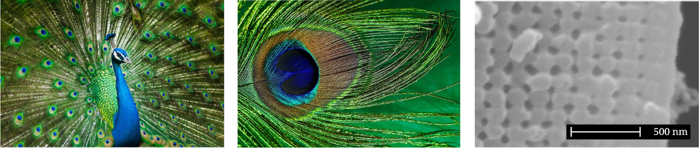
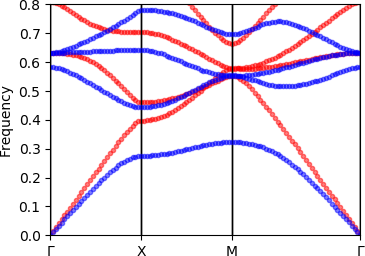
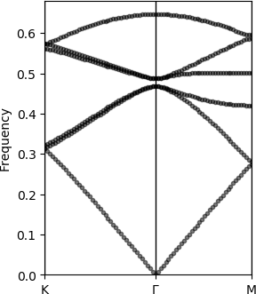

<div align="center">
</img>
</div>

[](https://sp94.github.io/Peacock.jl/stable)

## Introduction

`Peacock.jl` - or the **P**lane-wave **E**xpansion **A**pproach to **C**haracterising **O**ptical **C**rystals in **k**-space - is a Julia package for studying photonic crystals using the Plane Wave Expansion Method.

Photonic crystals are materials whose optical properties arise from the structuring of the material when the size of the structures are comparable to the wavelengths of light. `Peacock.jl` is named for the irridescent colours of peacock feathers which arise not from pigmentation but from their photonic crystal structure, as shown below.


<sub>Credits: Peacock by allanlau2000 from pixabay. Feather by suju from pixabay. Electron microscope image of photonic crystal structure from Zi, Jian, et al. "Coloration strategies in peacock feathers.",  *Proceedings of the National Academy of Sciences* 100.22 (2003): 12576-12578. Copyright (2003) National Academy of Sciences.</sub>

As well as occuring naturally as in animals such as peacocks, advances in nanofabrication mean that 'designer' photonic crystals can now be manufactured for unprecedented control over the flow of light, with applications ranging from optical fibers to photonic circuitry. Photonic crystals are also a promising platform for more exotic materials like topological insulators.

* Solve for...
	* Transverse electric (TE) and transverse magnetic (TM) modes of 2D photonic crystals
	* Non-orthogonal unit cells
	* Inhomogeneous permittivity and/or permeability
	* Chern numbers of topological photonic crystals using built-in Wilson loop methods

* Focused on ease of use
	* Install with one line in Julia's package manager
	* Simple visualisation of geometry, fields, and fully labelled band diagrams


## Example usage

### Installation

The package can be installed using the built-in Julia package manager
```julia
using Pkg
Pkg.add("Peacock")
```

After installation, the package can be loaded in Julia
```julia
using Peacock
```

This example will also use `PyPlot` to control our figures, and the `Parameters` package to unpack some tuples.
```julia
using Pkg
Pkg.add("PyPlot")
Pkg.add("Parameters")
using PyPlot
using Parameters
```


### Defining a photonic crystal in real space

A photonic crystal is defined using the `Geometry` constructor, which requires the optical properties of the crystal, lattice vectors, and resolution. Here we demonstrate how to define the photonic crystal used in figures 2 and 3 of chapter 5 of _Photonic crystals: molding the flow of light_ by Joannopoulos (see further reading).
```julia
# Permittivity
function epf(x,y)
    if x^2+y^2 < 0.2^2
        return 8.9
    else
        return 1
    end
end

# Permeability
function muf(x,y)
    return 1
end
    
# Lattice vectors
a1 = [1, 0]
a2 = [0, 1]

# Real-space resolution
d1 = d2 = 0.01

geometry = Geometry(epf, muf, a1, a2, d1, d2)
plot(geometry)
```
> 

### Defining the solver

The `Solver` approximates the geometry using a truncated Plane Wave Expansion (see further reading). The number of plane waves is determined by the cutoff. Increasing the cutoff will increase the accuracy of the solution, but low-contrast photonic crystals can be well approximated with a relatively low number of plane waves.

```julia
fourier_space_cutoff = 7
solver = Solver(geometry, fourier_space_cutoff)
plot(solver)
```
> 


### Plotting the band structure of a photonic crystal

Band structures can be generated using `plot_band_diagram(solver, ks, polarisation)`. If the elements of `ks` are instances of `BrillouinZoneCoordinate` then the band diagram will be fully labelled.

```julia
G = BrillouinZoneCoordinate(  0,   0, "Γ")
X = BrillouinZoneCoordinate(1/2,   0, "X")
M = BrillouinZoneCoordinate(1/2, 1/2, "M")
ks = [G,X,M,G]

figure(figsize=(4,3))
plot_band_diagram(solver, ks, TE, color="red",
            bands=1:4, dk=0.1, frequency_scale=1/2pi)
plot_band_diagram(solver, ks, TM, color="blue",
            bands=1:4, dk=0.1, frequency_scale=1/2pi)
ylim(0,0.8)
```
> 

This reproduces figure 2 of chapter 5 of Joannopoulos *et al* 2008.

### Plotting the modes

A `Mode` can be visualised using `plot(mode)`. By default the full Bloch wave is plotted - set `bloch_phase=false` to plot the cell-periodic part of Bloch mode.

The out of plane field component is plotted - for TE and TM polarisations this will be the magnetic and electric fields, respectively. The titles of the figures are set automatically using the `label` of the `Mode` object.

```julia
modes = solve(solver, X, TM)
plot(modes[2], bloch_phase=true)
plot(modes[2], bloch_phase=false)
```

> 

This reproduces figure 3 of chapter 5 of Joannopoulos *et al* 2008. Note that `Peacock.jl` doesn't fix the phase of the solutions and your results may differ by a random phase.


### The `Peacock.Zoo` submodule

The `Peacock.Zoo` module contains some of the photonic crystals that I have studied. Each `make_*` function returns a `NamedTuple` containing the geometry, solver, polarisation, and high symmetry points of the crystal. For example, the topological photonic crystal first introduced by Wu *et al* 2015 can be reproduced using `make_wu_topo`.

```julia
using Peacock.Zoo

# Load photonic topological insulator from Wu et al 2015
@unpack geometry, solver, polarisation, G, K, M = make_wu_topo(fourier_space_cutoff)

# Preview the crystal
plot(geometry)
```

> 

Here I used the `@unpack` macro from the `Parameters` package to unpack the named tuple.

```julia
# Plot the first six bands
figure(figsize=(3,4))
plot_band_diagram(solver, [K,G,M], polarisation,
        bands=1:6, frequency_scale=1/2pi, dk=0.1)
```

> 


### Topology of photonic bands

Recently there has been a spike of interest in photonic crystals as a platform for topological photonics (Blanco de Paz 2020). We provide methods to identify the topological phase of a photonic crystal using Wilson loops. A winding in the Wilson loop spectrum can indicate a non-trivial topological phase, with the Chern number given by the winding. In this example we reproduce results that demonstrate the photonic crystal with 'fragile' band topology that was introduced by Blanco de Paz et al (Blanco de Paz 2019).

```julia
using Peacock.Zoo

# Load the fragile photonic topological insulator from Blanco de Paz et al 2018
@unpack solver, polarisation = make_dePaz_frag(fourier_space_cutoff)

# The Wilson loops are (by default) along b2, so we define a straight
# path from Γ to Γ+b1 - we will scan along this path
ks = [
    BrillouinZoneCoordinate(0.0, 0.0, "Γ"),
    BrillouinZoneCoordinate(0.5, 0.0, "M"),
    BrillouinZoneCoordinate(1.0, 0.0, "Γ")
]

# Wilson loop of all three valence bands
figure(figsize=(3,2))
plot_wilson_loop_winding(solver, ks, polarisation, 1:3, dk=0.25)
title("Bands 1-3")

# Wilson loop of just the second and third bands
figure(figsize=(3,2))
plot_wilson_loop_winding(solver, ks, polarisation, 2:3, dk=0.25)
title("Bands 2&3")
```

> 

In the first figure, the Wilson loops through the Hilbert spaces of bands 2&3 are seen to wind with Chern numbers ±1. The second figure shows that including the (trivial) acoustic band in the Wilson loop calculation removes the topological winding, and consequently bands 2&3 are said to be 'fragilely topological'.


## Further reading

Plane Wave Expansion Method
- Rumpf, Raymond. "Design and optimization of nano-optical elements by coupling fabrication to optical behavior." (2006)
- http://emlab.utep.edu/academics.htm

Photonic crystals
- Joannopoulos, John D., et al. "Photonic crystals: molding the flow of light. 2008." *Princeton Univ Pr* (freely available online at http://ab-initio.mit.edu/book/)

Topological photonics
- Wu, Long-Hua, and Xiao Hu. "Scheme for achieving a topological photonic crystal by using dielectric material." Physical review letters 114.22 (2015): 223901.
- Blanco de Paz, María, et al. "Engineering fragile topology in photonic crystals: Topological quantum chemistry of light." *Physical Review Research* 1.3 (2019): 032005.
- Blanco de Paz, María, et al. "Tutorial: computing topological invariants in 2D photonic crystals." *Advanced Quantum Technologies* 3.2 (2020): 1900117.
