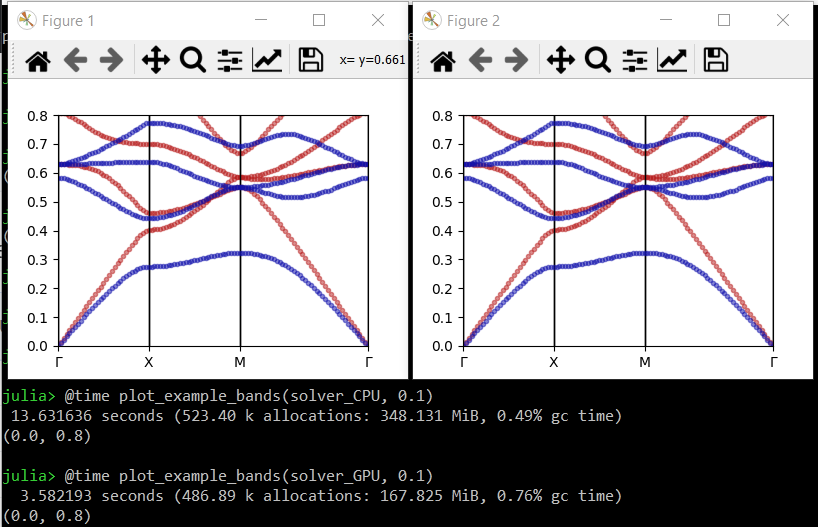

# [How to accelerate calculations using CUDA-compatible GPUs](@id how_to_GPU)

!!! note "Added in Peacock v0.1.2."
    You will need Peacock v0.1.2 or later for this feature.

## Summary
Pass `GPU=true` when creating your [`Solver`](@ref).

```julia
solver = Solver(geometry, fourier_space_cutoff, GPU=true)
```

## Full example

By default, `Peacock.jl` uses the CPU. However, you may be able to accelerate your calculations if you have a CUDA-compatible GPU.

Let's begin by defining a simple photonic crystal.
```julia
using Peacock, PyPlot

function epf(x,y)
    # equation of a circle with radius 0.2a
    if x^2+y^2 <= 0.2^2
        # dielectric inside the circle
        return 8.9
    else
        # air outside the circle
        return 1
    end
end

# Permeability is unity everywhere
function muf(x,y)
    return 1
end

a1 = [1, 0]  # first lattice vector
a2 = [0, 1]  # second lattice vector
d1 = 0.01  # resolution along first lattice vector
d2 = 0.01  # resolution along second lattice vector
geometry = Geometry(epf, muf, a1, a2, d1, d2)
```

When we construct the `Solver` from the `Geometry`, we can pass the `GPU` flag. By default, `GPU=false`.
```julia
fourier_space_cutoff = 9  # larger = more accurate, slower
solver_CPU = Solver(geometry, fourier_space_cutoff)
solver_GPU = Solver(geometry, fourier_space_cutoff, GPU=true)
```

The fields of the `solver_CPU` are standard Julia arrays, but the fields of the `solver_GPU` are CUDA arrays which will utilise the GPU.
```julia
typeof(solver_CPU.epc) == Array{Complex{Float64},2}
typeof(solver_GPU.epc) == CUDA.CuArray{Complex{Float64},2}
```

Now, let's compare the time to solve and plot some bands with and without the GPU.
```julia
function plot_example_bands(solver, dk)
    G = BrillouinZoneCoordinate(  0,   0, "Γ")
    X = BrillouinZoneCoordinate(1/2,   0, "X")
    M = BrillouinZoneCoordinate(1/2, 1/2, "M")
    ks = [G,X,M,G]
    figure(figsize=(4,3))
    plot_band_diagram(solver, ks, TE, color="red",
                bands=1:4, dk=dk, frequency_scale=1/2pi)
    plot_band_diagram(solver, ks, TM, color="blue",
                bands=1:4, dk=dk, frequency_scale=1/2pi)
    ylim(0,0.8)
end

# call once to make sure functions are compiled
plot_example_bands(solver_CPU, 2)
plot_example_bands(solver_GPU, 2)

# time CPU vs GPU
close("all")
@time plot_example_bands(solver_CPU, 0.1)
@time plot_example_bands(solver_GPU, 0.1)
show()
```

We find a significant speed up using the GPU - ~13.6 seconds vs ~3.6 seconds.



## Further reading

- [CUDA.jl](https://github.com/JuliaGPU/CUDA.jl): CUDA programming in Julia