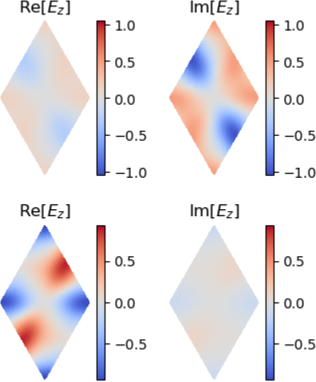
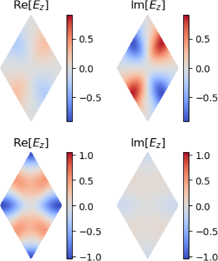

# [How to calculate symmetry eigenmodes of a crystal](@id how_to_symmetries)

In this how-to guide we show how to calculate the symmetry eigenmodes of an example crystal.
```julia
# load an example crystal from the Zoo
using Peacock, Peacock.Zoo, Parameters, LinearAlgebra
@unpack geometry, solver, polarisation, K, G, M = make_dePaz_frag(7)
plot(geometry)

# plot band diagram
figure(figsize=(3,4))
plot_band_diagram(solver, [K,G,M], polarisation, frequency_scale=1/2pi, dk=0.1)
ylabel("Frequency " * L"[\omega a / 2 \pi c]")
ylim(0, 0.6)
```


Note that the second and third bands have the same frequency at Γ. If we plot these modes, they may not have an obvious symmetry to them.
```julia
# plot bands 2 and 3
modes = solve(solver, G, polarisation);
for mode in modes[2:3]
    plot(mode)
end
```


However, any linear combination of the modes is also a valid solution with the same frequency. We can seek the linear combination of modes with a particular symmetry using `symmetry_eigenmodes`. For example, the combination that is  mirror symmetric in the x-axis is
```julia
# get the eigenspace spanned by second and third frequency eigenmodes
space = Eigenspace(modes[2:3])

# get the mirror eigenmodes
mirror_modes = symmetry_eigenmodes(space, mirror_x)

for mode in mirror_modes
    plot(mode)
end
```


The eigenvalues of the `mirror_modes` are now the eigenvalues of the mirror symmetry.
```julia-repl
# Mirror eigenvalues to 2 decimal places
julia> round.(100 * [mode.eigenvalue for mode in mirror_modes]) / 100
2-element Array{Complex{Float64},1}:
 -1.0 - 0.0im
  1.0 - 0.0im
```
You can also use `symmetry_eigvals(space, symmetry)` if you are only interested in the eigenvalues.
