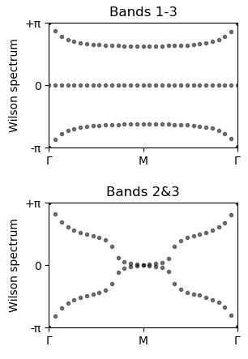

# [How to study band topology with Wilson loops](@id how_to_topology)

## Background

Recently there has been a spike of interest in photonic crystals as a platform for topological photonics (see further reading). We provide methods to identify the topological phase of a photonic crystal using Wilson loops.

A winding in the Wilson loop spectrum can indicate a non-trivial topological phase, with the Chern number given by the winding. In this example we reproduce results that demonstrate the photonic crystal with 'fragile' band topology that was introduced in Blanco de Paz *et al* 2019.

This crystal [can be loaded from the Zoo](@ref how_to_zoo) using [`make_dePaz_frag`](@ref).
```julia
using Peacock, Peacock.Zoo, Parameters

# Size of the plane-wave basis
fourier_space_cutoff = 7

# Load the fragile photonic topological insulator from Blanco de Paz et al 2018
@unpack geometry, solver, polarisation = make_dePaz_frag(fourier_space_cutoff)

# Visualise the geometry
plot(geometry)
```


## Plotting the Wilson loop winding

First, let's define the ``k``-path we want to scan along, labelling the high symmetry points using [`BrillouinZoneCoordinate`](@ref).
```julia
# The Wilson loops are (by default) along b2, so we define a straight
# path from Γ to Γ+b1 - we will scan along this path
ks = [
    BrillouinZoneCoordinate(0.0, 0.0, "Γ"),
    BrillouinZoneCoordinate(0.5, 0.0, "M"),
    BrillouinZoneCoordinate(1.0, 0.0, "Γ")
]
```

Now we can reproduce the Wilson loop winding figures of Blanco de Paz *et al* 2019 using [`plot_wilson_loop_winding`](@ref).
```julia
# Wilson loop of all three valence bands
figure(figsize=(3,2))
plot_wilson_loop_winding(solver, ks, polarisation, 1:3, dk=0.25)
title("Bands 1-3")

# Wilson loop of just the second and third bands
figure(figsize=(3,2))
plot_wilson_loop_winding(solver, ks, polarisation, 2:3, dk=0.25)
title("Bands 2&3")
```


In the first figure, the Wilson loops through the Hilbert spaces of bands 2&3 wind with Chern numbers ±1, indicating some non-trivial topology. However, the second figure shows that including the (trivial) acoustic band in the Wilson loop calculation removes the topological winding, and consequently bands 2&3 are said to be 'fragilely topological'.


## Further reading

- Wu, Long-Hua, and Xiao Hu. "Scheme for achieving a topological photonic crystal by using dielectric material." Physical review letters 114.22 (2015): 223901.
- Blanco de Paz, María, et al. "Engineering fragile topology in photonic crystals: Topological quantum chemistry of light." *Physical Review Research* 1.3 (2019): 032005.
- Blanco de Paz, María, et al. "Tutorial: computing topological invariants in 2D photonic crystals." *Advanced Quantum Technologies* 3.2 (2020): 1900117.
