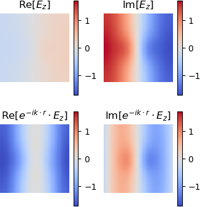

# Getting started

This tutorial will help you get started with `Peacock.jl` for the first time.

We will install `Peacock.jl`, and then use it to study an example photonic crystal from a book (Joannopoulos *et al* 2008) by plotting the band structure and visualising the modes of the crystal.

## Installation

Before using `Peacock.jl` for the first time, you should install it using the built-in Julia package manager.
```julia
using Pkg
Pkg.add("Peacock")
```

After installation, the `Peacock.jl` can be loaded in Julia.
```julia
using Peacock
```

For this tutorial, we'll also install and load `PyPlot` to control our figures.
```julia
using Pkg
Pkg.add("PyPlot")
using PyPlot
```


## Defining the photonic crystal

In this section we will create a  [`Geometry`](@ref) that holds the shape, size, and materials of the crystal.

The crystal we will reproduce in this tutorial is taken from chapter 5 of Joannopoulos *et al* 2008. It consists of dielectric cylinders (``\epsilon_\mathrm{cyl}=8.9, \mu_\mathrm{cyl}=1``) in air (``\epsilon_\mathrm{air}=1, \mu_\mathrm{air}=1``). The cylinders are arranged on a square lattice with separation ``a``, and each cylinder has a radius of ``r=a/5``.

First, let's define the functions `epf(x,y)` and `muf(x,y)`, which return the permittivity and permeability of the unit cell at ``(x,y)``, where ``(0,0)`` is the center of the unit cell. We will work in units of length where the separation between cylinders is unity, ``a=1``, such the radius of each cylinder is `0.2`.
```julia
# Permittivity
function epf(x,y)
	# equation of a circle with radius 0.2a
    if x^2+y^2 <= 0.2^2
    	# dielectric inside the circle
        return 8.9
    else
    	# air outside the circle
        return 1
    end
end

# Permeability is unity everywhere
function muf(x,y)
    return 1
end
```

Now we declare the lattice parameters. The cylinders are on a square lattice, so our lattice vectors are orthogonal and of equal length `a`.
```julia
a1 = [1, 0]  # first lattice vector
a2 = [0, 1]  # second lattice vector
```

We must also give the resolution at which the geometry should be generated at.
```julia
d1 = 0.01  # resolution along first lattice vector
d2 = 0.01  # resolution along second lattice vector
```
A smaller value of `d1` or `d1` will result in a higher resolution grid.

Finally, we are ready to construct and visualise our [`Geometry`](@ref).
```julia
geometry = Geometry(epf, muf, a1, a2, d1, d2)
plot(geometry)
```


## Setting up the solver

In this section we will create a [`Solver`](@ref) that approximates the geometry using a truncated Plane Wave Expansion (see further reading). The number of plane waves is determined by the cutoff. Increasing the cutoff will increase the accuracy of the solution, but low-contrast photonic crystals can be well approximated with a relatively small basis of plane waves.
```julia
fourier_space_cutoff = 7
solver = Solver(geometry, fourier_space_cutoff)
```

Plotting the [`Solver`](@ref) lets you visualise how the [`Geometry`](@ref) has been approximated.
```julia
plot(solver)
```


## Plotting the band structure

When light passes through a photonic crystal, the frequency of the wave, ``\omega``, is related to its momentum, ``\vec{k}``. It is common to plot the frequencies as a function of momentum, ``\omega(\vec{k})``, to produce a "band diagram" (see Joannopolous *et al* 2008).

First, we must define the corners of a path through the Brillouin zone. We can use [`BrillouinZoneCoordinate`](@ref) to attach a label to our coordinates, so that our band diagram plots nicely.
```julia
G = BrillouinZoneCoordinate(  0,   0, "Γ")
X = BrillouinZoneCoordinate(1/2,   0, "X")
M = BrillouinZoneCoordinate(1/2, 1/2, "M")
ks = [G,X,M,G]
```

Now we can call [`plot_band_diagram(solvers, ks, polarisation)`](@ref) to produce our diagram. If we provide the `dk` keyword argument, the path will be sampled so that the spacing between ``k``-points is `dk` or smaller. The crystal behaves differently depending on the polarisation of light, so we plot the transverse electric (TE) polarised bands in red and the transverse magnetic (TM) polarised bands in blue.
```julia
figure(figsize=(4,3))
plot_band_diagram(solver, ks, TE, color="red",
            bands=1:4, dk=0.1, frequency_scale=1/2pi)
plot_band_diagram(solver, ks, TM, color="blue",
            bands=1:4, dk=0.1, frequency_scale=1/2pi)
ylim(0,0.8)
```


This reproduces figure 2 of chapter 5 of Joannopoulos *et al* 2008.


## Plotting a mode

Often it is useful to visualise the electric and magnetic fields in the crystal. Here we show how to solve and plot the modes of a photonic crystal at a particular ``k``-point.

First, we call [`solve`](@ref), which returns an array of [`Mode`](@ref)s.
```julia
modes = solve(solver, X, TM)
```

A `Mode` can be visualised using `plot(mode)`. By default the full Bloch wave is plotted - set `bloch_phase=false` to plot the cell-periodic part of Bloch mode.
```julia
plot(modes[2], bloch_phase=true)
plot(modes[2], bloch_phase=false)
```


The out of plane field component is plotted - for TE and TM polarisations this will be the magnetic and electric fields, respectively. The titles of the figures are set automatically using the `label` of the `Mode`.

This reproduces figure 3 of chapter 5 of Joannopoulos *et al* 2008. Note that `Peacock.jl` doesn't fix the phase of the solutions and your results may differ by a random phase.


## Further reading

Plane Wave Expansion Method
- Rumpf, Raymond. "Design and optimization of nano-optical elements by coupling fabrication to optical behavior." (2006)
- Rumpf, Raymond. "Computational Electromagnetics lecture course." [Available online](http://emlab.utep.edu/academics.htm).

Photonic crystals
- Joannopoulos, John D., *et al*. "Photonic crystals: molding the flow of light. 2008." *Princeton Univ Press*. [Available online](http://ab-initio.mit.edu/book/).
